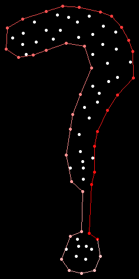

# concave-hull

`concave-hull` is an implementation of the [gift opening concave hull algorithm](https://deeplearning.lipingyang.org/wp-content/uploads/2019/07/Project-10-report_Implementation-of-a-fast-and-efficient-concave-hull-algorithm.pdf), written in Rust.



The top level export is a function called `concave_hull`.
See the docs for that function for details on usage, or check the example at `examples/basic.rs`

## Choosing the concavity parameter

Concave hulls are a somewhat subjective thing.
While it's possible to generate a concave hull which minimizes the area of the final polygon, this is often undesirable, as it leads to very crinkly shapes.
To remedy this, a concavity parameter is exposed, which controls how tight the final concave hull is around the point cloud.
In general, you should pick a concavity parameter which produces "desirable" results on your datasets, whatever that means for your application.
Here is some guidance:
- The concavity parameter ranges from zero to positive infinity
- `0` produces a maximally crinkly shape
- `+inf` prevents any concavity, returning the convex hull of the point cloud
- `40` is usually a good starting point

Note that the concavity parameter **is not scale invariant**.
This means that a point cloud which covers an area from 0 to 100 will need a smaller concavity parameter than an equivalent point cloud that covers an area from 0 to 1000.

## Features

This crate has one feature, `benches`, which is only used for benchmarks.
End users of this library should never enable it.

## The CLI Crate

In the `cli` folder is a small CLI that exposes the library's functionality.
I originally wrote it for testing, but it might be useful for one-off usages of the library.

Basic usage:
```
cargo run -p cli --release -- 50 ./test_data/question_mark.csv -i ./output.png
```
will generate the above question mark image.
The slight gradient on the hull shows the winding: the first edges are fully red, then they fade to pink.

For more information:
```
cargo run -p cli --release -- --help
```

Note that images generated by the CLI are centered on the point cloud's coordintes, and 10 pixels of padding are added to each edge.
Additionally, the coordinates are flipped from the standard image coordinate space (y down) to the standard math coordinate space (y up).
This means that the minimum point values are in the bottom left corner, and the maximum point values are in the top right corner, as you would expect for a plot.

## Testing

Various point clouds can be found in `test_data`, with different shapes, sizes, and properties.
These are used for unit tests and benchmarks.
